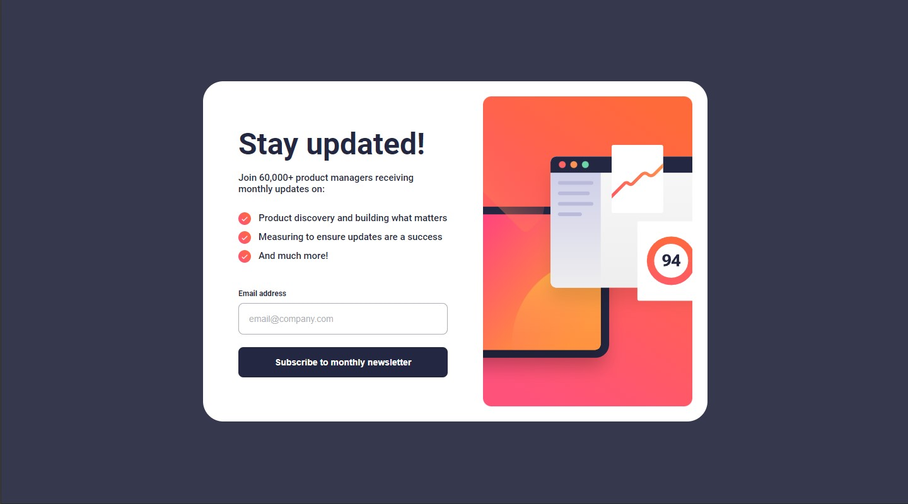
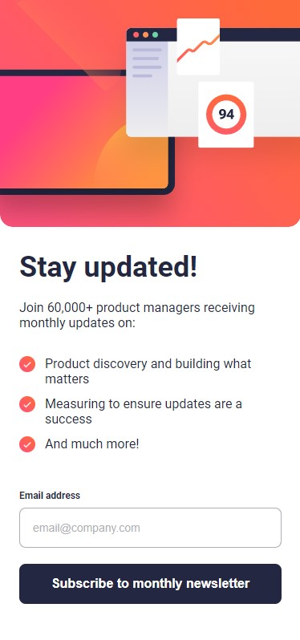

# Newsletter sign-up form with success message

This is a solution to the [Newsletter sign-up form with success message challenge on Frontend Mentor](https://www.frontendmentor.io/challenges/newsletter-signup-form-with-success-message-3FC1AZbNrv).

## Table of contents

- [Overview](#overview)
  - [The challenge](#the-challenge)
  - [Screenshot](#screenshot)
  - [Links](#links)
- [My process](#my-process)
  - [Built with](#built-with)
- [Author](#author)

## Overview

### The challenge

Users should be able to:

- Add their email and submit the form
- See a success message with their email after successfully submitting the form
- See form validation messages if:
  - The field is left empty
  - The email address is not formatted correctly
- View the optimal layout for the interface depending on their device's screen size
- See hover and focus states for all interactive elements on the page

### Screenshot

#### Desktop

#### Mobile

### Links

- Solution URL: [Code](https://github.com/hellcsaba/news-letter-sign-up)
- Live Site URL: [Newsletter sign-up live](https://hellcsaba.github.io/news-letter-sign-up/)

## My process

### Built with

- Semantic HTML5 markup
- CSS custom properties
- Flexbox
- Mobile-first workflow
- JavaScript

## Author

- Website - [Csaba Hell](https://github.com/hellcsaba)
- Frontend Mentor - [@hellcsaba](https://www.frontendmentor.io/profile/hellcsaba)
- LinkedIn - [@csabahell](https://www.linkedin.com/in/csabahell/)
